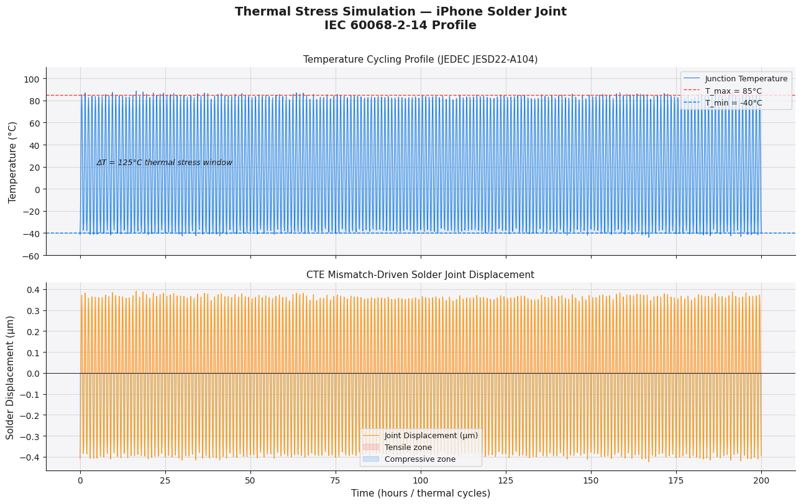
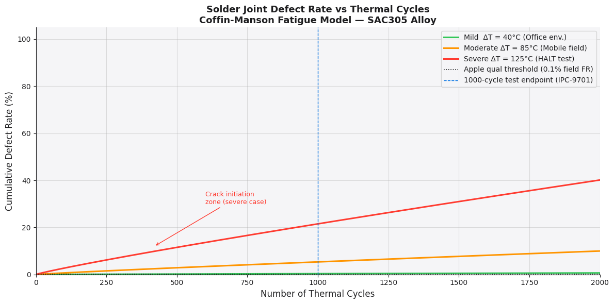
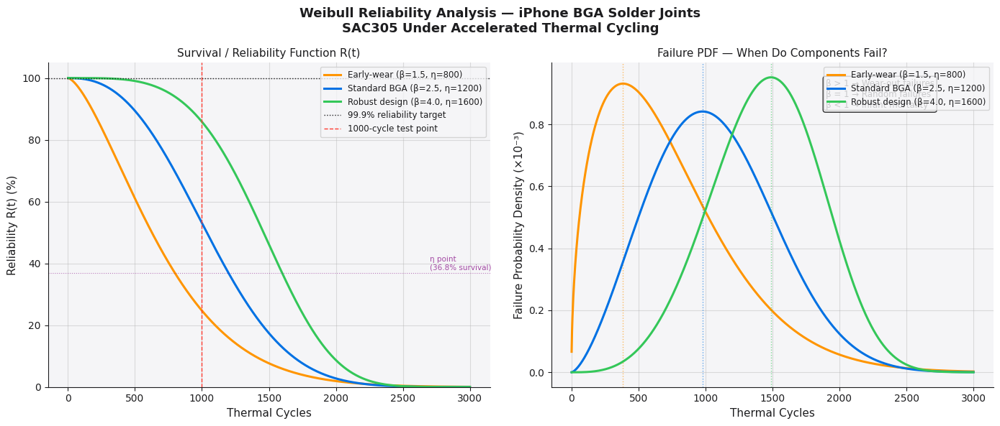

# Project 1 — Failure Analysis Case Study
### BGA Solder Joint Cracking Under Thermal Stress
> **Simulated case study** built to demonstrate PQE methodology 
> for Apple PQE Internship application — Pohang, Korea

---

## What This Project Covers
A two-part engineering project simulating how a Process Quality 
Engineer investigates solder joint failures on an iPhone main 
logic board.

**Part A — Python Analysis Notebook**
**Part B — Formal Failure Analysis Report (PDF)**

---

## Part A — Notebook Results

### Plot 1: Thermal Stress Simulation

Temperature cycling –40°C ↔ +85°C and resulting CTE mismatch 
displacement in solder joints (µm). Based on JEDEC JESD22-A104 
Condition G profile.

### Plot 2: Defect Rate vs Thermal Cycles

Coffin-Manson fatigue model showing how failure rate accelerates 
across three thermal stress levels (mild / moderate / severe ΔT).

### Plot 3: Weibull Reliability Curves

Survival function R(t) and failure PDF for three β/η scenarios. 
Includes B10 life and MTTF calculations.

---

## Part B — FA Report
📄 [Download Full Report (PDF)](Apple_PQE_FA_Report_v2.pdf)

Report structure follows real Apple PQE methodology:
- Problem description & failure reproduction
- Fishbone (Ishikawa) root cause diagram
- Analytical tools: X-ray → SEM → FIB escalation
- 8D corrective action plan
- Cost of Quality (PAF model) analysis
- Sign-off matrix

---

## Standards & References Applied
| Standard | Description |
|---|---|
| IPC-9701A | Performance Test Methods for Solder Joint Reliability |
| JEDEC JESD22-A104 | Temperature Cycling Test Conditions |
| IPC-7711/7721 | Rework, Repair and Modification |
| Coffin-Manson (1954) | Thermomechanical fatigue model |
| Weibull W. (1951) | Statistical reliability distribution |

---

## Key Concepts Demonstrated
- Weibull distribution (shape β, scale η, B10 life, MTTF)
- CTE mismatch mechanics in BGA packages
- Coffin-Manson fatigue life prediction
- SEM / FIB / X-ray failure characterisation workflow
- Cost of Quality — Prevention, Appraisal, Failure costs

---

## Tools Used
`Python` `NumPy` `SciPy` `Matplotlib` `ReportLab` `Google Colab`

---

*This is a simulated case study created for learning and 
portfolio purposes. All data, company references, and failure 
scenarios are fictional and for educational demonstration only.*
